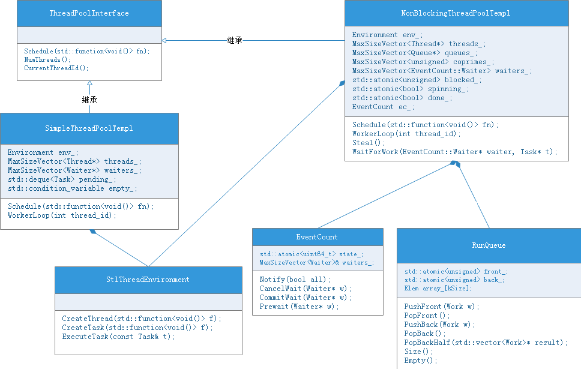

### 概述

tensorflow线程池模型是其并行处理的重要组件，它采用的是eigen库中的ThreadPool。在eigen中，提供了两个版本，SimpleThreadPool和NonBlockingThreadPool。

在tensorflow中，默认使用的是NonBlockingThreadPool。

### 类结构



### SimpleThreadPool

这是eigen库提供的一个简单版本的线程池实现，其任务队列使用std::deque实现，多个线程互斥地从任务队列中获取任务，并执行。这是一种work-sharing的实现方式。

客户端的调用代码如下：

```
void Schedule(std::function<void()> fn) final {
   Task t = env_.CreateTask(std::move(fn));
   std::unique_lock<std::mutex> l(mu_);
   if (waiters_.empty()) {   
     pending_.push_back(std::move(t));
   } else {
     Waiter* w = waiters_.back();
     waiters_.pop_back();    
     w->ready = true;
     w->task = std::move(t); 
     w->cv.notify_one();
   }
}
```

队列消费代码如下：

```
void WorkerLoop(int thread_id) {
  std::unique_lock<std::mutex> l(mu_);
  PerThread* pt = GetPerThread();
  pt->pool = this;
  pt->thread_id = thread_id;
  Waiter w;
  Task t;
  while (!exiting_) {
    if (pending_.empty()) {
      // Wait for work to be assigned to me
      w.ready = false;
      waiters_.push_back(&w);
      while (!w.ready) {
        w.cv.wait(l);
      }
      t = w.task;
      w.task.f = nullptr;
    } else {
      // Pick up pending work
      t = std::move(pending_.front());
      pending_.pop_front();
      if (pending_.empty()) {
        empty_.notify_all();
      }
    }
    if (t.f) {
      mu_.unlock();
      env_.ExecuteTask(t);
      t.f = nullptr;
      mu_.lock();
    }
  }
}
```


### NonBlockingThreadPool

NonBlockingThreadPool的实现相对要复杂一些，其实现方式是work-stealing，有以下几个特点：

- 每个工作线程，都拥有自己的工作队列；
- 工作队列的实现为：队尾有锁操作，队头无锁操作；
- 当前线程工作队列为空时，会从其他线程的工作队列中获取任务；
- 插入任务时，优先加入操作线程自己的工作队列；

客户端调用代码如下：

```
void Schedule(std::function<void()> fn) {
    Task t = env_.CreateTask(std::move(fn));
    PerThread* pt = GetPerThread();
    if (pt->pool == this) {
      // Worker thread of this pool, push onto the thread's queue.
      Queue* q = queues_[pt->thread_id];
      t = q->PushFront(std::move(t));
    } else {
      // A free-standing thread (or worker of another pool), push onto a random
      // queue.
      Queue* q = queues_[Rand(&pt->rand) % queues_.size()];
      t = q->PushBack(std::move(t));
    }
    // Note: below we touch this after making w available to worker threads.
    // Strictly speaking, this can lead to a racy-use-after-free. Consider that
    // Schedule is called from a thread that is neither main thread nor a worker
    // thread of this pool. Then, execution of w directly or indirectly
    // completes overall computations, which in turn leads to destruction of
    // this. We expect that such scenario is prevented by program, that is,
    // this is kept alive while any threads can potentially be in Schedule.
    if (!t.f)
      ec_.Notify(false);
    else
      env_.ExecuteTask(t);  // Push failed, execute directly.
}
```

队列消费代码，如：

```
void WorkerLoop(int thread_id) {
    PerThread* pt = GetPerThread();
    pt->pool = this;
    pt->rand = std::hash<std::thread::id>()(std::this_thread::get_id());
    pt->thread_id = thread_id;
    Queue* q = queues_[thread_id];
    EventCount::Waiter* waiter = &waiters_[thread_id];
    for (;;) {
      Task t = q->PopFront();
      if (!t.f) {
        t = Steal();
        if (!t.f) {
          // Leave one thread spinning. This reduces latency.
          // TODO(dvyukov): 1000 iterations is based on fair dice roll, tune it.
          // Also, the time it takes to attempt to steal work 1000 times depends
          // on the size of the thread pool. However the speed at which the user
          // of the thread pool submit tasks is independent of the size of the
          // pool. Consider a time based limit instead.
          if (!spinning_ && !spinning_.exchange(true)) {
            for (int i = 0; i < 1000 && !t.f; i++) {
              t = Steal();
            }
            spinning_ = false;
          }
          if (!t.f) {
            if (!WaitForWork(waiter, &t)) {
              return;
            }
          }
        }
      }
      if (t.f) {
        env_.ExecuteTask(t);
      }
    }
}
```

主循环的流程：

1. 从队头取任务，若取到，则跳步骤 5；否则，
2. 若spinning_==false，即没线程正在steal，则，
3. 执行steal，从其他线程队列中，直到取到任务，最多执行1000次，若不能取任务，则
4. 提交等待任务；
5. 执行任务；

需要说明的，tensorflow中NonBlockingThreadPool的实现，不同版本之间会有些差异，但主要的算法逻辑没有变化。

WaitForWork的实现

```
bool WaitForWork(EventCount::Waiter* waiter, Task* t) {
    eigen_assert(!t->f);
    ec_.Prewait(waiter);
    int victim = NonEmptyQueueIndex();
    if (victim != -1) {
      ec_.CancelWait(waiter);
      *t = queues_[victim]->PopBack();
      return true;
    }
    blocked_++;
    if (done_ && blocked_ == threads_.size()) {
      ec_.CancelWait(waiter);
      if (NonEmptyQueueIndex() != -1) {
        blocked_--;
        return true;
      }
      ec_.Notify(true);
      return false;
    }
    ec_.CommitWait(waiter);
    blocked_--;
    return true;
}
```

具体步骤

1. 预等待任务
2. 查找一个非空队列，若找到，则从该队列中取走一个任务，否则，
3. 若被设置为退出，则取消等待，同时判断队列中是否还有任务，防止线程结束时，有任务丢失；否则，
4. 提交等待请求；

#### EventCount

EventCount是ThreadPool中实现的非阻塞同步机制，核心算法原理可参考：[Dekker's algorithm](https://en.wikipedia.org/wiki/Dekker's_algorithm#References)。

算法原理，伪代码如下：

```

    variables
        wants_to_enter : array of 2 booleans
        turn : integer

    wants_to_enter[0] ← false
    wants_to_enter[1] ← false
    turn ← 0   // or 1
    
p0:
   wants_to_enter[0] ← true
   while wants_to_enter[1] {
      if turn ≠ 0 {
         wants_to_enter[0] ← false
         while turn ≠ 0 {
           // busy wait
         }
         wants_to_enter[0] ← true
      }
   }

   // critical section
   ...
   turn ← 1
   wants_to_enter[0] ← false
   // remainder section
   
p1:
   wants_to_enter[1] ← true
   while wants_to_enter[0] {
      if turn ≠ 1 {
         wants_to_enter[1] ← false
         while turn ≠ 1 {
           // busy wait
         }
         wants_to_enter[1] ← true
      }
   }
 
   // critical section
   ...
   turn ← 0
   wants_to_enter[1] ← false
   // remainder section
```

因此，代码细节不再分析。以下为调用示例代码：

```
Waiting thread does:

   if (predicate)
     return act();
   EventCount::Waiter& w = waiters[my_index];
   ec.Prewait(&w);
   if (predicate) {
     ec.CancelWait(&w);
     return act();
   }
   ec.CommitWait(&w);

Notifying thread does:

   predicate = true;
   ec.Notify(true);

```


#### RunQueue

RunQueue是基于数组实现的队列。它的特点是：

- 队列大小必须为2的幂；
- 操作队列的角色有owner和remoter，其中，owner是队列的拥有者线程，remoter则指需要操作队列的其他线程；
- owner在队头进行操作，remoter在队尾进行操作，多个remoter线程通过mutex互斥操作；
- 只授受指针类型的元素，因此，可以直接利用元素是否为空，来表示状态；
- 所有线程之间的同步通过，元素状态变量来实现；
- back最后一个元素位置，front待插入新元素位置；
- front和back的高位，用来进行操作计数，即front的push和back的pop，均在高位加1。当front==back时，若高位相同，则队列为空，若不同，则队列满；但eigen的RunQueue中，未用到该判断；
- front和back采用原子操作，避免了字节对齐的问题；

具体代码如下：

```
Work PushFront(Work w) {
    unsigned front = front_.load(std::memory_order_relaxed);
    Elem* e = &array_[front & kMask];
    uint8_t s = e->state.load(std::memory_order_relaxed);
    if (s != kEmpty ||
        !e->state.compare_exchange_strong(s, kBusy, std::memory_order_acquire))
      return w;
    front_.store(front + 1 + (kSize << 1), std::memory_order_relaxed);
    e->w = std::move(w);
    e->state.store(kReady, std::memory_order_release);
    return Work();
}

Work PopFront() {
    unsigned front = front_.load(std::memory_order_relaxed);
    Elem* e = &array_[(front - 1) & kMask];
    uint8_t s = e->state.load(std::memory_order_relaxed);
    if (s != kReady ||
        !e->state.compare_exchange_strong(s, kBusy, std::memory_order_acquire))
      return Work();
    Work w = std::move(e->w);
    e->state.store(kEmpty, std::memory_order_release);
    front = ((front - 1) & kMask2) | (front & ~kMask2);
    front_.store(front, std::memory_order_relaxed);
    return w;
}

Work PushBack(Work w) {
    std::unique_lock<std::mutex> lock(mutex_);
    unsigned back = back_.load(std::memory_order_relaxed);
    Elem* e = &array_[(back - 1) & kMask];
    uint8_t s = e->state.load(std::memory_order_relaxed);
    if (s != kEmpty ||
        !e->state.compare_exchange_strong(s, kBusy, std::memory_order_acquire))
      return w;
    back = ((back - 1) & kMask2) | (back & ~kMask2);
    back_.store(back, std::memory_order_relaxed);
    e->w = std::move(w);
    e->state.store(kReady, std::memory_order_release);
    return Work();
}

Work PopBack() {
    if (Empty()) return Work();
    std::unique_lock<std::mutex> lock(mutex_, std::try_to_lock);
    if (!lock) return Work();
    unsigned back = back_.load(std::memory_order_relaxed);
    Elem* e = &array_[back & kMask];
    uint8_t s = e->state.load(std::memory_order_relaxed);
    if (s != kReady ||
        !e->state.compare_exchange_strong(s, kBusy, std::memory_order_acquire))
      return Work();
    Work w = std::move(e->w);
    e->state.store(kEmpty, std::memory_order_release);
    back_.store(back + 1 + (kSize << 1), std::memory_order_relaxed);
    return w;
}
 
unsigned Size() const {
    // Emptiness plays critical role in thread pool blocking. So we go to great
    // effort to not produce false positives (claim non-empty queue as empty).
    for (;;) {
      // Capture a consistent snapshot of front/tail.
      unsigned front = front_.load(std::memory_order_acquire);
      unsigned back = back_.load(std::memory_order_acquire);
      unsigned front1 = front_.load(std::memory_order_relaxed);
      if (front != front1) continue;
      int size = (front & kMask2) - (back & kMask2);
      // Fix overflow.
      if (size < 0) size += 2 * kSize;
      // Order of modification in push/pop is crafted to make the queue look
      // larger than it is during concurrent modifications. E.g. pop can
      // decrement size before the corresponding push has incremented it.
      // So the computed size can be up to kSize + 1, fix it.
      if (size > static_cast<int>(kSize)) size = kSize;
      return size;
    }
}
  
```

