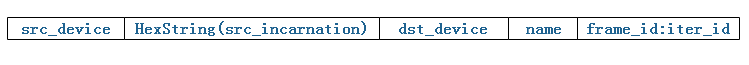
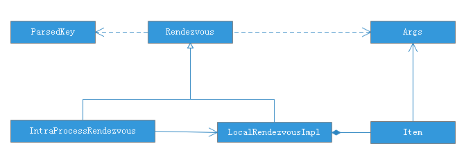
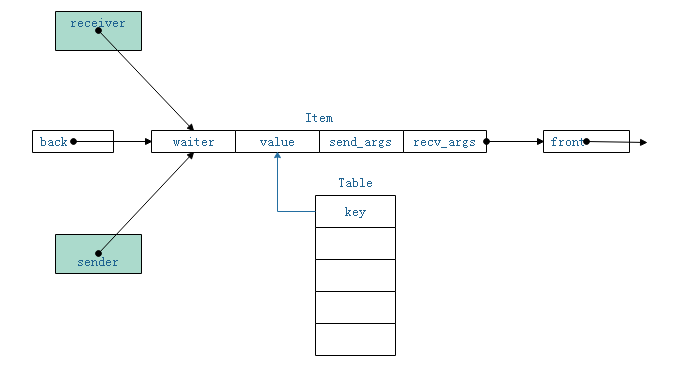
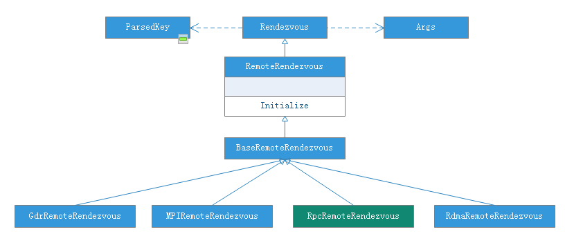
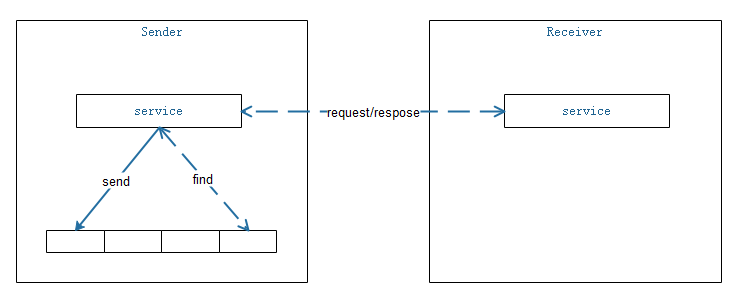
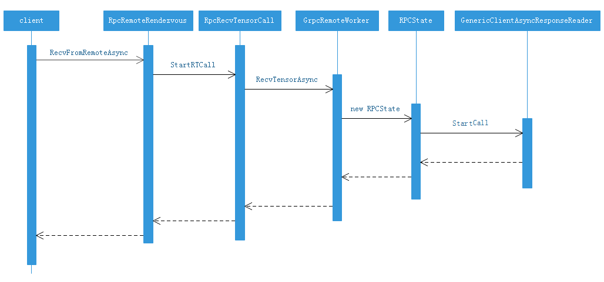
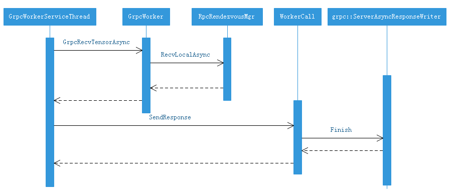

## tensorflow通信机制

#### 概述

Rendezvous作为Tensorflow中消息传输的重要组件，具有如下特点：

1、一对通信设备之间，拥有自己独立的channel，通过唯一key标识；

2、channel中消息是有序的，receiver是按照sender的顺序进行处理；

3、receiver可以在消息到达之前或之后，请求channel中的tensor；若消息未到达，回调过程将会由sender完成；

4、send过程是非阻塞；

#### ParsedKey结构

ParsedKey结构是通信双方的唯一标识，从而保证通信双方的消息内容不会错乱。定义如下：

```
  struct ParsedKey {
  	// 发送设备字符串，如：/job:localhost/replica:0/task_id:0/device:GPU:0
    StringPiece src_device;
    
    // src_device解析后对应的结构体；
    DeviceNameUtils::ParsedName src;
    
    // 该值在work重启后，会发生变化；
    uint64 src_incarnation = 0;
    
    // 接收设备字符串，格式与src_device相同；
    StringPiece dst_device;
    
    // dst_device解析后对应的结构体；
    DeviceNameUtils::ParsedName dst;
    
    // 可以指定为任何字符串，用于区分不同的key
    StringPiece edge_name;
  };
```

ParsedKey包含两个重要的过程：CreateKey和ParseKey。其中，CreateKey实现从ParsedKey结构编码为字符串；ParseKey实现从字符串解析为ParsedKey;

经过CreateKey编码后的字符串格式为：



其中，

HexString(src_incamation)是src_incarnation的十六进制字符串；

字段之间用分号分隔，因此，src_device和dst_device中，不能包含分号；

frame_id和iter_id一般直接取自OPKernelContext中的FrameAndIter对象，该字段在解码时，直接丢弃；


#### 本地传输

本地传输中，tensorflow有LocalRendezvous和IntraProcessRendezvous两个类，但是IntraProcessRendezvous是对LocalRendezvous的一个封装，因此，仅分析LocalRendezvous。

**类关系图**




LocalRendezvousImpl的消息缓存通过一个map结构存储，具体定义如下：

```
typedef std::deque<Item*> ItemQueue;

// key为ParsedKey编码后字符串Hash64生成
typedef gtl::FlatMap<uint64, ItemQueue> Table;

struct Item {
  // 消息处理时回调函数
  DoneCallback waiter = nullptr;
  
  // 参与计算的张量
  Tensor value;
  
  // 没有输入的控制节点
  bool is_dead = false;
  
  // 发送方参数
  Args send_args;
  
  // 接收方参数
  Args recv_args;
};
```

**传输过程**

传输结构如下图所示：



需要说明的是，rendezous不能保证总是sender先于receiver到达。于是，在传输过程中，回调函数(waiter)的执行，总是由后到的一方执行。通过这种方式，也使用得整个传输过程的完全异步化。虽然，LocalRendezvousImpl提供了同步方法，但是也只是对其异步方法的封装。

Send过程：

1、计算ParsedKey的hash值，并在table中查到对应的通信队列；

2、若队列为空，或者队头元素的waiter为空，则初始化item的value、is_dead和send_args参数，写入队列；否则，

3、说明receiver已经提前到达，取队头元素，执行回调，即item->waiter();

代码片段如下所示：

```
Status Send(const ParsedKey& key, const Args& send_args, const Tensor& val,
              const bool is_dead) override {
    uint64 key_hash = KeyHash(key.FullKey());
    VLOG(2) << "Send " << this << " " << key_hash << " " << key.FullKey();

    mu_.lock();
    if (!status_.ok()) {
      // Rendezvous has been aborted.
      Status s = status_;
      mu_.unlock();
      return s;
    }

    ItemQueue* queue = &table_[key_hash];
    if (queue->empty() || queue->front()->IsSendValue()) {
      // There is no waiter for this message. Append the message
      // into the queue. The waiter will pick it up when arrives.
      // Only send-related fields need to be filled.
      Item* item = new Item;
      item->value = val;
      item->is_dead = is_dead;
      item->send_args = send_args;
      if (item->send_args.device_context) {
        item->send_args.device_context->Ref();
      }
      queue->push_back(item);
      mu_.unlock();
      return Status::OK();
    }

    // There is an earliest waiter to consume this message.
    Item* item = queue->front();
    queue->pop_front();
    mu_.unlock();

    // Notify the waiter by invoking its done closure, outside the
    // lock.
    DCHECK(!item->IsSendValue());
    item->waiter(Status::OK(), send_args, item->recv_args, val, is_dead);
    delete item;
    return Status::OK();
}

```

RecvAsync过程：

1、计算ParsedKey的hash值，并在table中查到对应的通信队列；

2、若队列为空，或者队头元素的waiter不为空，则初始化item的waiter和send_args参数，写入队列；否则，

3、取队头元素，执行回调，done();

注意在2中，队头元素waiter不为空，说明，队列中仍有消息，未被sender处理完成，因此需要新建消息并入队列。

代码片段如下：

```
void RecvAsync(const ParsedKey& key, const Args& recv_args,
                 DoneCallback done) override {
    uint64 key_hash = KeyHash(key.FullKey());
    VLOG(2) << "Recv " << this << " " << key_hash << " " << key.FullKey();

    mu_.lock();
    if (!status_.ok()) {
      // Rendezvous has been aborted.
      Status s = status_;
      mu_.unlock();
      done(s, Args(), recv_args, Tensor(), false);
      return;
    }

    ItemQueue* queue = &table_[key_hash];
    if (queue->empty() || !queue->front()->IsSendValue()) {
      // There is no message to pick up.
      // Only recv-related fields need to be filled.
      Item* item = new Item;
      item->waiter = std::move(done);
      item->recv_args = recv_args;
      if (item->recv_args.device_context) {
        item->recv_args.device_context->Ref();
      }
      queue->push_back(item);
      mu_.unlock();
      return;
    }

    // A message has already arrived and is queued in the table under
    // this key.  Consumes the message and invokes the done closure.
    Item* item = queue->front();
    queue->pop_front();
    mu_.unlock();

    // Invokes the done() by invoking its done closure, outside scope
    // of the table lock.
    DCHECK(item->IsSendValue());
    done(Status::OK(), item->send_args, recv_args, item->value, item->is_dead);
    delete item;
}

```

IntraProcessRendezvous只是在其回调函数中，增加了对设备的适配处理，其他地方，与LocalRendezvousImpl基本一致。

#### 远程传输


**类关系图**



远程通信的类图关系如上图所示，本文仅对RpcRemoteRendezvous进行分析。


**整体过程**



RpcRemoteRendezvous的通信过程，是基于grpc的异步处理框架。整体过程如图所示，其中，实线表示send，虚线表示是receive过程；

send时，将tensor写本地缓存中；当Receiver机器需要获取tensor时，往Sender机器，发起网络请求；Sender接收到请求后，从本地缓存中查找到所需的tensor，并序列化后，发往Receiver。因此，在receive过程中，存在客户端和服务端两个角色。


**Send过程**

Send过程与LocalRendezvousImpl相同，将tensor发往本地缓存；


**客户端角色**

调用的序列图如下所示：



客户端过程相关的几个类：

**RpcRemoteRendezvous**

实现RecvFromRemoteAsync方法；主要功能是，RpcRecvTensorCall对象的初始化，注册和调用；代码片段如下：

```
void RpcRemoteRendezvous::RecvFromRemoteAsync(
    const Rendezvous::ParsedKey& parsed, const Rendezvous::Args& recv_args,
    DoneCallback done) {
  CHECK(is_initialized());
  Status s;

  // Prepare a RecvTensor call that can handle being aborted.
  RpcRecvTensorCall* call = get_call_freelist()->New();

  // key.src_device identifies a remote device.
  if (!DeviceNameUtils::SplitDeviceName(parsed.src_device, &call->src_worker_,
                                        &call->src_rel_device_)) {
    s = errors::Internal(parsed.src_device,
                         " is invalid remote source device.");
  }
  WorkerSession* sess = session();
  WorkerInterface* rwi = sess->worker_cache->CreateWorker(call->src_worker_);
  if (s.ok() && rwi == nullptr) {
    s = errors::Internal("No worker known as ", call->src_worker_);
  }

  Device* dst_device;
  if (s.ok()) {
    s = sess->device_mgr()->LookupDevice(parsed.dst_device, &dst_device);
  }
  if (!s.ok()) {
    if (rwi != nullptr) {
      sess->worker_cache->ReleaseWorker(call->src_worker_, rwi);
    }
    get_call_freelist()->Release(call, sess->worker_cache.get());
    done(s, Args(), recv_args, Tensor{}, false);
    return;
  }

  call->Init(rwi, step_id_, parsed.FullKey(), recv_args.alloc_attrs, dst_device,
             recv_args, std::move(done));

  // Record "call" in active_ so that it can be aborted cleanly.
  RegisterCall(call);

  // RendezvousMgr already aborted, shouldn't send RPC call any more
  if (!call->status().ok()) {
    call->done()(call->status(), Args(), Args(), Tensor(), false);
    session()->worker_cache->ReleaseWorker(call->src_worker_, call->wi_);
    call->wi_ = nullptr;
    get_call_freelist()->Release(call, session()->worker_cache.get());
    return;
  }

  // Start "call".
  Ref();
  call->Start([this, call]() {
    // Removes "call" from active_. Prevent StartAbort().
    DeregisterCall(call);
    // If StartAbort was called prior to DeregisterCall, then the
    // current status should be bad.
    Status s = call->status();
    call->done()(s, Args(), call->recv_args(), call->tensor(), call->is_dead());
    session()->worker_cache->ReleaseWorker(call->src_worker_, call->wi_);
    call->wi_ = nullptr;
    get_call_freelist()->Release(call, session()->worker_cache.get());
    Unref();
  });
}
```

**RpcRecvTensorCall**

```
void StartRTCall(std::function<void()> recv_done) {
    resp_.InitAlloc(dst_device_, alloc_attrs_);
    using namespace std::placeholders;
    StatusCallback cb = std::bind(
        [this](std::function<void()> recv_done,
               // Begin unbound arguments.
               const Status& s) {
          if (!s.ok()) {
            mutex_lock l(mu_);
            status_.Update(s);
          }
          recv_done();
        },
        std::move(recv_done), _1);
    wi_->RecvTensorAsync(&opts_, &req_, &resp_, std::move(cb));
}
```

**GrpcRemoteWorker**

```
void RecvTensorAsync(CallOptions* call_opts, const RecvTensorRequest* request,
                       TensorResponse* response, StatusCallback done) override {
    VLOG(1) << "RecvTensorAsync req: " << request->DebugString();
    int64 start_usec = Env::Default()->NowMicros();
    // Type-specialized logging for this method.
    bool logging_active = logger_->LoggingActive() || VLOG_IS_ON(2);
    StatusCallback wrapper_done;
    const StatusCallback* cb_to_use;
    if (!logging_active) {
      cb_to_use = &done;  // No additional work to do, so just use done directly
    } else {
      wrapper_done = [this, request, response, done, start_usec](Status s) {
        if (logger_->LoggingActive()) {
          int64 end_usec = Env::Default()->NowMicros();
          int64 step_id = request->step_id();
          int64 bytes = response->tensor().TotalBytes();
          int64 send_start_usec = start_usec;
          // If a send start time was reported by the other side, use
          // that instead.  Maybe we should mark the display if we're using
          // our local time instead of the remote start time?
          if (response->metadata().send_start_micros()) {
            // send_start_micros is the timestamp taken when the
            // remote machine began to send the RecvTensor response.
            // Due to clock skew between source and dest machines, it
            // is possible that send_start_micros can be larger than
            // end_usec or less than start_usec.
            //
            // To respect causality, we enforce the invariants that
            // the RecvTensor response can not have been sent before
            // the RecvTensor request, and must have been sent before
            // it was received.
            send_start_usec = std::max(
                start_usec,
                static_cast<int64>(response->metadata().send_start_micros()));
            send_start_usec = std::min(send_start_usec, end_usec - 1);
          }
          const string& key = request->rendezvous_key();
          std::vector<string> key_parts = str_util::Split(key, ';');
          if (key_parts.size() != 5) {
            LOG(WARNING) << "Bad key: " << key;
          } else {
            logger_->RecordRecvTensor(step_id, send_start_usec, end_usec,
                                      key_parts[3],  // tensor name
                                      key_parts[0],  // src_device
                                      key_parts[2],  // dst_device
                                      bytes);
          }
        }
        VLOG(2) << "done callback, req: " << request->DebugString()
                << " response " << response->metadata().DebugString();
        done(s);
      };
      cb_to_use = &wrapper_done;
    }

    IssueRequest(request, response, recvtensor_, *cb_to_use, call_opts);
}
```

**RPCState**

主要功能是，完成grpc的异步调用，并等待结果将返回; 

```
RPCState(::grpc::GenericStub* stub, ::grpc::CompletionQueue* cq,
           const ::grpc::string& method, const Request& request,
           Response* response, StatusCallback done, CallOptions* call_opts,
           thread::ThreadPool* threadpool, bool fail_fast, int64 timeout_in_ms)
      : call_opts_(call_opts), threadpool_(threadpool), done_(std::move(done)) {
    context_.set_fail_fast(fail_fast);
    if (timeout_in_ms > 0) {
      context_.set_deadline(gpr_time_from_millis(timeout_in_ms, GPR_TIMESPAN));
    }

    if (call_opts) {
      call_opts->SetCancelCallback([this]() { context_.TryCancel(); });
    }

    response_ = response;
    ::grpc::Status s = GrpcMaybeUnparseProto(request, &request_buf_);
    if (!s.ok()) {
      LOG(ERROR) << "GrpcMaybeUnparseProto returned with non-ok status: "
                 << s.error_message();
    }
    call_ =
        std::move(stub->PrepareUnaryCall(&context_, method, request_buf_, cq));
    call_->StartCall();
    call_->Finish(&response_buf_, &status_, this);
}
```


**服务端角色**

由于服务端会涉及到grpc的异步处理流程，因此，为了描述更简单清晰，这里仅讨论服务端接收到请求后的调用过程。即，GrpcWorkerServiceThread中针对RecvTensorHandlerRaw的处理过程。




该部分代码建议结合grpc的异步实现来阅读。